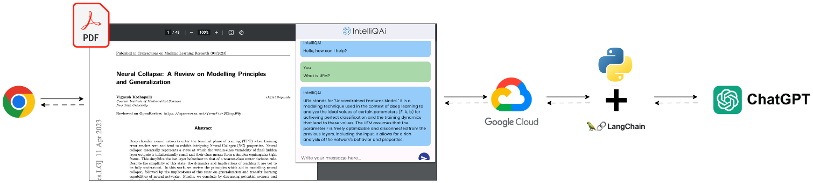

# IntelliQAi

PDF Question Answering (QA) powered by ChatGPT.

<video src="assets/videos/GKD_demo.mp4" controls title="IntelliQAi Demo"></video>

## Overview

A handy Chrome extension I built that leverages the power of Large Language Models (LLMs), such as [ChatGPT](https://openai.com/blog/chatgpt), to ingest new data in the form of PDF documents and enable the user to perform QA tasks.

The project has two main components:

* Chrome extension frontend built using [Flutter](https://flutter.dev/) and [Dart](https://dart.dev/)
* Application backend built using [🦜️🔗 LangChain](https://python.langchain.com), OpenAI's ChatGPT, and [Google Cloud Functions](https://cloud.google.com/functions) for serverless deployment

To deploy and run the application yourself, you will need an OpenAI account with API key for accessing ChatGPT and a Google Cloud account to access the Cloud Functions service.

## Steps to run

1. Install Flutter: <https://docs.flutter.dev/get-started/install>
2. Create a new Google Cloud Function with the source code found in `backend/`. You will need to provide your OpenAI API key as an environment variable named `API_KEY`
3. Make note of the deployed URL and update the `baseUrl` and `urlExt` variables in `lib/summary_api_client.dart`
4. Build the Chrome extension package with `flutter build web --web-renderer html --csp`
5. Load the build `build/web` into Chrome Extensions developer mode
6. Test out IntelliQAi on any PDF!
